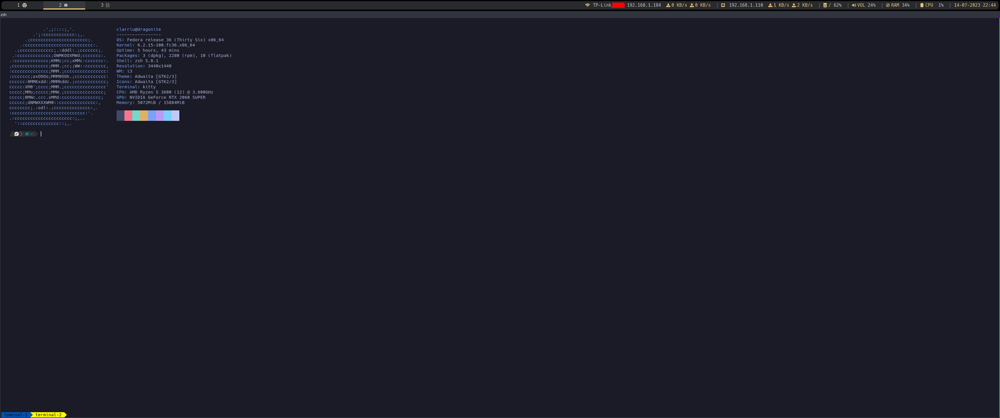
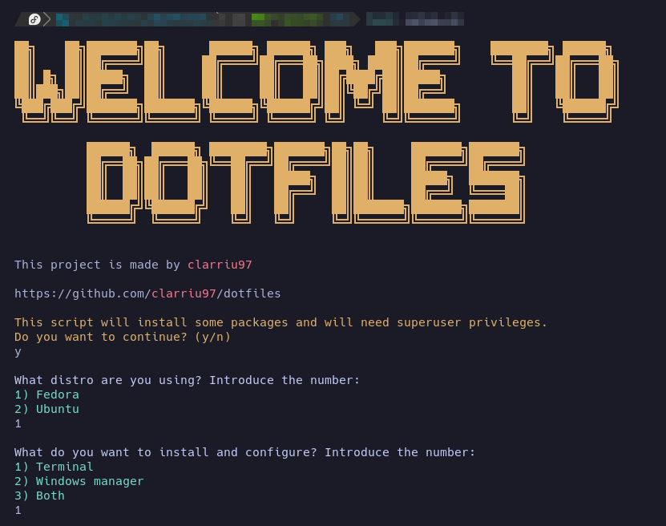
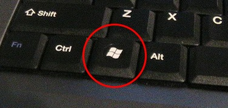

## Welcome

This repository is meant to store all the files and configurations needed to instantly setup my Linux working environment to my liking.

This tool can configure two main things:

- Your terminal: using `zsh`, [`powerlevel10k`](https://github.com/romkatv/powerlevel10k) and some `zsh` plugins.
- Your Windows Manager: using [i3wm](https://i3wm.org/)

## Overview

This is how your environment will look like if you install everything.



## Support

The tool supports the following Linux distributions:

- [Fedora 36](https://getfedora.org/)
- [Ubuntu 20.04](https://ubuntu.com/)

## Needs

To automate the process and to avoid problems, you should have the following tools installed:

- [GNU Make](https://www.gnu.org/software/make/)
- [Git](https://git-scm.com/)

## Get started

> In the installation process there will be actions that require super user permissions
> and the process will reboot your system when it finishes.

To start the installation of all tools and configurations, simply run the following command:

```bash
git clone https://github.com/clarriu97/dotfiles && cd dotfiles && make -s setup-env
```

You will be asked about the Linux distro you are using, and the tools you want to configure.
You can choose between:

1. Only the terminal.
2. Only the windows manager.
3. Both the terminal and the windows manager.



Once you have selected the options that best fit your needs, the installation and
configuration process will begin.

## User guide and shortcuts

`in3` is a windows manager with which we will be able to manage all our windows environment
with the keyboard. For that purpose, every command will be a combination of the `$mod` key plus
any other keys. In my case, the `$mod` key is the `Windows` key:



The shortcuts related to the windows manager are:

- `Win` + `Enter`: open the terminal emulator (`kitty`).
- `Win` + number(`n`): move to window `n`.
- `Win` + `Shift` + number(`n`): move the window you are working on, to window `n`.
- `Win` + `Tab`: move to the last window you were working on.
- `Win` + `Shift` + `Q`: close the window you are working on.
- `Win` + `Shift` + `H`: uses `xrandr` to place the screens in the home layout, adapting the orientation and resolution of these screens.
- `Win` + `Shift` + `G`: uses `xrandr` to place the screens in the office layout, adapting the orientation and resolution of these screens.
- `Win` + `Shift` + `B`: uses `xrandr` to display only the primary screen.
- `Win` + `R`: resize your windows (use `ESC` for escape this mode).
- `Win` + `Shift` + `S`: take a screenshot using [flameshot](https://github.com/flameshot-org/flameshot).
- `Win` + `Shift` + `E`: open `Files`.
- `Win` + `Ctrl` + `R`: reboot the machine.
- `Win` + `Ctrl` + `P`: power off the machine.

The shortcuts you will be able to use in your terminal are:
- `Ctrl` + `Shift` + `t`: open a new tab.
- `Ctrl` + `Shift` + `Alt` + `t`: rename a tab
- `Ctrl` + `Shift` + `Letf arrow`: move to the left tab.
- `Ctrl` + `Shift` + `Right arrow`: move to the right tab.
- `Ctrl` + `Shift` + `,` move a tab to the left (spanish keyboard distribution).
- `Ctrl` + `Shift` + `.` move a tab to the right (spanish keyboard distribution).
